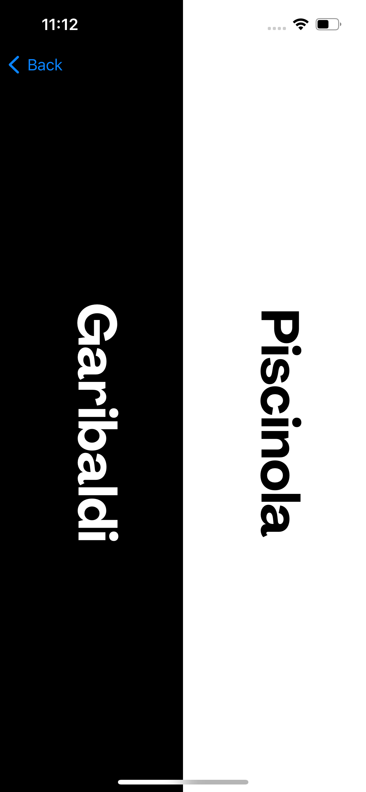
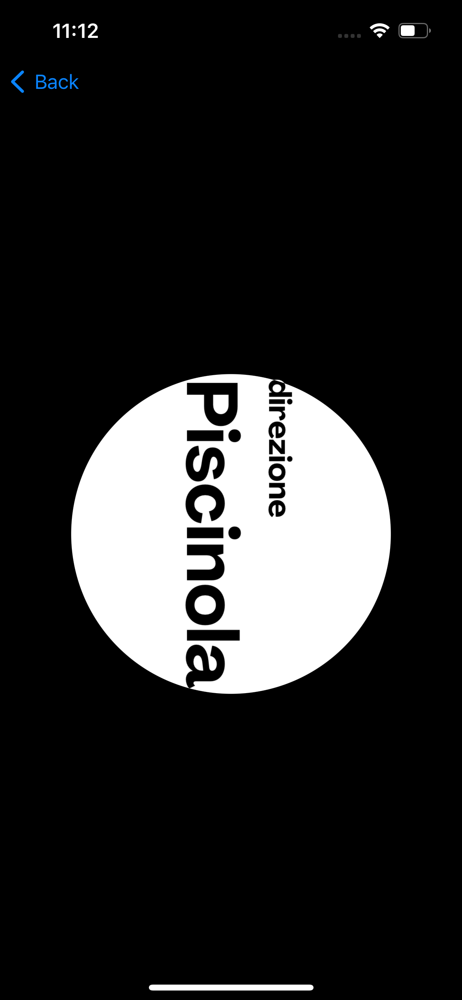
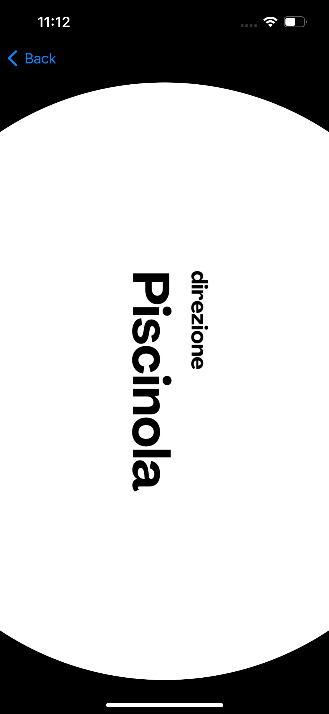

# Progetto di Orientamento Assistito per Stazioni

Questo progetto è realizzato in collaborazione con l'ANM e l'Accademia delle Belle Arti. L'obiettivo è rivoluzionare il sistema LOGES nelle stazioni, offrendo un aiuto concreto a persone non vedenti, ipovedenti e a coloro che hanno difficoltà di orientamento. Il progetto utilizza sensori iBeacon per tracciare i movimenti nello spazio. Quando una persona deve prendere un treno specifico, il sistema si attiva per fornire indicazioni tramite vibrazioni e segnali visivi sul percorso da seguire. Inoltre, l'app è completamente compatibile con il VoiceOver di iOS.

Nel progetto, mi sono occupato specificamente della parte di back-end relativa al calcolo del percorso e della logica della schermata del percorso, inclusi la vibrazione in prossimità dei beacon e l'effetto grafico del pallino che si ingrandisce quando ci si avvicina.

## Caratteristiche principali

- **Tracciamento con iBeacon:** Utilizzo di sensori iBeacon per tracciare i movimenti e fornire indicazioni precise.
- **Compatibilità con VoiceOver:** L'app è completamente accessibile tramite VoiceOver di iOS.
- **Feedback tramite Vibrazioni:** Il sistema fornisce indicazioni tramite vibrazioni per guidare l'utente.
- **Segnali Visivi:** Effetti grafici che aiutano l'utente a orientarsi meglio nello spazio.

## Immagini del progetto

### Schermata di Benvenuto

### Indicazioni di Direzione

### Schermata del Percorso

## Come Funziona

1. **Configurazione del Percorso:**
   - L'utente seleziona la destinazione desiderata e il sistema calcola il percorso ottimale.
   - Viene visualizzata la schermata del percorso con indicazioni precise.

2. **Navigazione Assistita:**
   - Durante la navigazione, l'utente riceve feedback tramite vibrazioni quando si avvicina a un beacon.
   - Gli effetti grafici mostrano un pallino che si ingrandisce per indicare la vicinanza al beacon.

3. **Compatibilità con VoiceOver:**
   - L'app funziona perfettamente con VoiceOver, fornendo descrizioni vocali per ogni indicazione.
